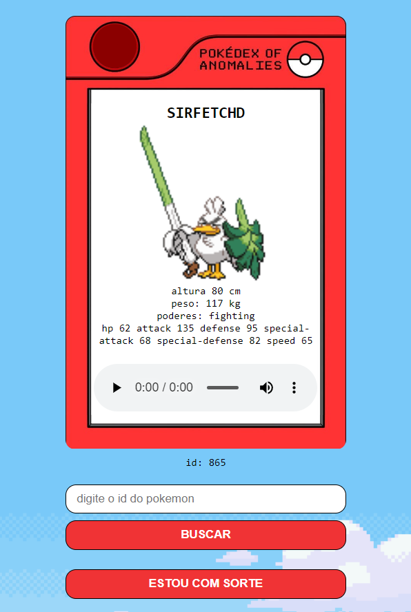

# Pokédex

Este projeto é uma Pokédex interativa que utiliza uma API para obter informações sobre os Pokémons. Você pode visualizar os detalhes de cada Pokémon, como altura, peso, habilidades, e estatísticas base. 

## Demonstração

Você pode acessar a Pokédex através do seguinte link: [Pokédex](https://pokedex-topaz-eight.vercel.app/)



## Funcionalidades

- Busca de Pokémon por ID.
- Exibição de informações detalhadas de cada Pokémon, incluindo altura, peso, habilidades e estatísticas.
- Interface de usuário inspirada no design clássico da Pokédex.

## Tecnologias Utilizadas

- HTML
- CSS
- JavaScript
- API de Pokémon

## Instalação

Para rodar este projeto localmente, siga os passos abaixo:

1. Clone o repositório:
    ```bash
    git clone https://github.com/seu-usuario/pokedex-de-anomalias.git
    ```
2. Navegue até o diretório do projeto:
    ```bash
    cd pokedex-de-anomalias
    ```
3. Abra o arquivo `index.html` no seu navegador preferido.

## Uso

1. Digite o ID do Pokémon desejado no campo de busca.
2. Clique no botão "Buscar" para ver as informações do Pokémon.
3. Se preferir uma busca aleatória, clique no botão "Estou com sorte".

## Contribuição

Se você quiser contribuir para este projeto, siga os passos abaixo:

1. Faça um fork do repositório.
2. Crie uma nova branch:
    ```bash
    git checkout -b minha-nova-feature
    ```
3. Faça as alterações desejadas e commit:
    ```bash
    git commit -m 'Adiciona nova feature'
    ```
4. Envie suas alterações:
    ```bash
    git push origin minha-nova-feature
    ```
5. Abra um Pull Request.

## Licença

Este projeto está licenciado sob a MIT License - veja o arquivo [LICENSE](LICENSE) para mais detalhes.

---
